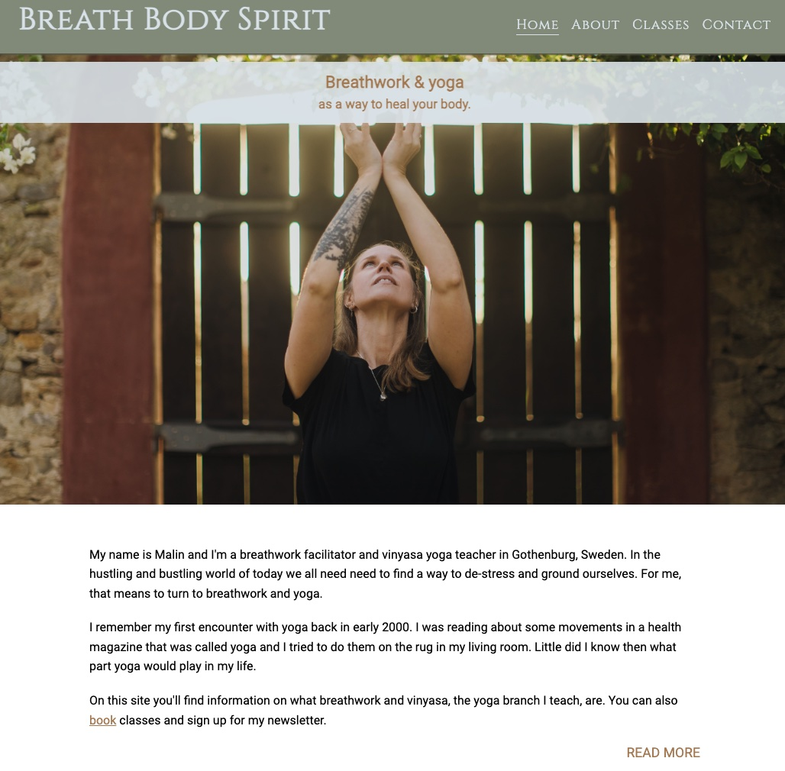
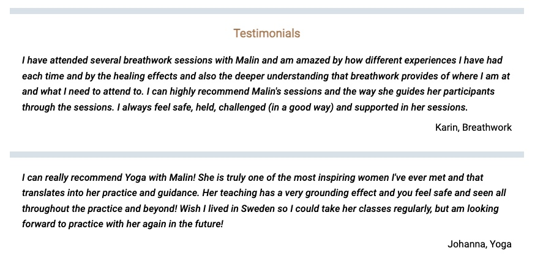
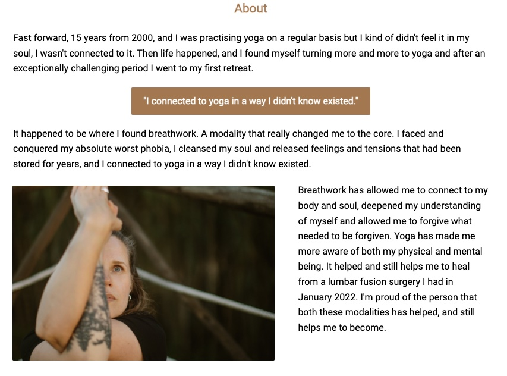
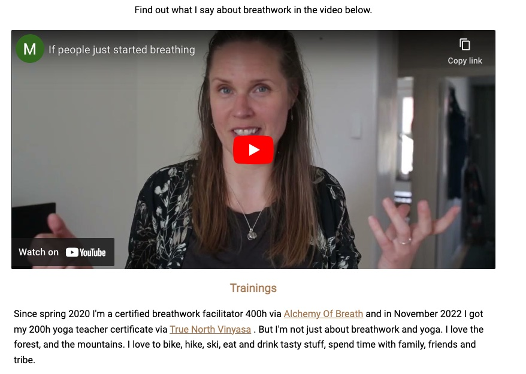
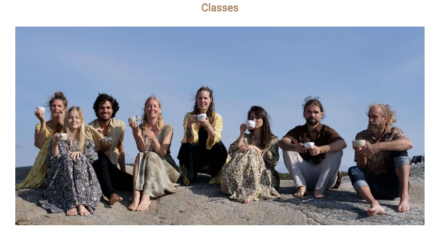
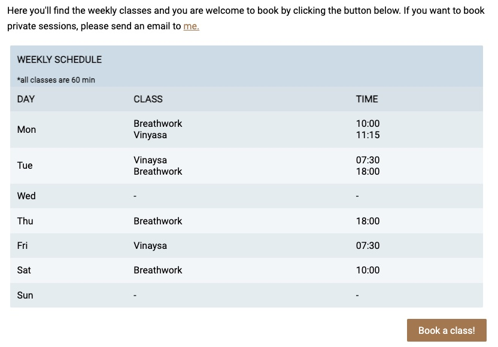

# Breath Body Spirit

Breath Body Spirit is a website for people that want to attend yoga and/or breathwork classes in Gothenburg, Sweden. It targets those who are interested in yoga and wellness but also in personal development.

They users will find information about the yoga and breathwork teacher, testimonials, schedule and how to book a class.

The pite can be found at [Breath Body Spirit](https://malinchristina.github.io/p1breathbodyspirit/index.html "Breath Body Spirit")

## Features

### Navigation bar

* The navigation bar is there to help the user easily navigate from one page to another.
* It is responsive on all screens.
  

### Footer

* The footer contains a referense to who made the site and the photographer.
* There are clickable icons to social media facebook and instagram, where information on events and photos not on the site can be found.
  
 

 ### Home

### About

### Classes

### Contact

## Testing

* All external links open in a new window and point correct.
* All internal links point correct.
* All buttons act as they supposed to.
* Video plays on the website and also points to youtube.
* All the pictures are loading.
* The website works in Chrome, Safari, Firefox.
* The website works on mobile phones Iphone, Samsung.
* The website works on tablet, Samsung.
* The website is fully responsive.
* The form works as intended. The user can not join without name, email address or ticking an agree button.

### Validator Testing

## Deployment

## Credits

### Coding instructions

* Inspiriation from Love Running project
* [Kevin Powell youtube channel](https://www.youtube.com/@KevinPowell "Kevin Powell")
* [w3schools](https://www.w3schools.com/ "w3shools")
* [Geeks for Geeks](https://www.geeksforgeeks.org/ "Geeks for Geeks")
* 404 page and signuplandingingpage from mentor Gareth McGirr [Tacos Travels](https://gareth-mcgirr.github.io/tacos-travels/index.html "Tacos Travels")
* Flexbox:
  * [Dave Geddes](https://mastery.games/flexboxzombies/chapter/2/level/22 "Flexbox Zombies")
  * [Flexbox Froggy](https://flexboxfroggy.com/ "Flexbox Froggy")
  * [Daisy McGirr](https://www.youtube.com/@IonaFrisbee "Dee Mc")

### Content

All content is owned by Breath Body Spirit AB, including photos and video.

### Media

Photos taken by [Isla Grossi](https://www.islagrossi.com/ "Isla Grossi photography")

Video shot by Nicholas Sosin and produced by [All My Friends Are Stars](https://www.allmyfriendsarestars.com/ "All My Friends Are Stars")
