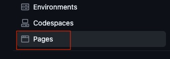

# Breath Body Spirit

Breath Body Spirit is a website for people that want to attend yoga and/or breathwork classes in Gothenburg, Sweden. It targets those who are interested in yoga and wellness but also in personal development.

The users will find information about the yoga and breathwork teacher, testimonials, schedule and how to book a class.

The live site can be found at [Breath Body Spirit](https://malinchristina.github.io/p1breathbodyspirit/index.html "Breath Body Spirit")

## Features

### Favicon

* Favicon is generated from the site name, Breath Body Spirit. Has the same color as the header and footer and same font as logo.
  

### Logo

* The logo is the same name as the site and company, Breath Body Spirit.
* The logo is clickable on each page and refers back to the home page for the user to easy access the first page.
  

### Navigation bar

* The navigation bar is there to help the user easily navigate from one page to another.
* It is responsive on all screens.
  

### Home

* The hero image was chosen to create a feeling of calmness.

* There is a short presenstation of what the site is about, with a link for those who emediately want to book a class or read even more about content.
* A section below of testimonials to ensure the user that this is a trustworthy person.
  

### About

* Starts of with a section of teachers story of how she found yoga and breathwork and what it have meant and means to her. To create connection to the user.
* The photo is to give a soft inclusive picture of yoga
  

* A video is added to talk about breathwork. It can be seen directly on the site or be opened in youtube.

* The last section lists trainings the teacher has taken with links to each site that offer the trainings.

### Classes

* Yoga and breathwork is about community and the picture was chosen to give that feeling.
  

* The weekly schedule shows the time and date for the classes and there is a link that directs to the site where the user can book and pay.
  

### Contact

* A section with text to incourage the user to sign up for newsletter.
* A section for those who wants to collaborate with a clickable icon that directs to compose an email.

### Footer

* The footer contains a referense to who made the site and the photographer.
* There are clickable icons to social media facebook and instagram, where information on events and photos not on the site can be found.
  
 

### Design

## Wireframe

* Home page

* About

* Classes

* Contact

### Testing

* All external links open in a new window and point correct.
* All internal links point correct.
* All buttons act as they supposed to.
* Video plays on the website and also points to youtube.
* All the pictures are loading.
* The website works in Chrome, Safari, Firefox.
* The website works on mobile phones Iphone, Samsung.
* The website works on tablet, Samsung.
* The website is fully responsive.
* The form works as intended. The user can not join without name, email address or ticking an agree button.

## Validator Testing

Testing of html was been done in [Validator W3](https://validator.w3.org/ "Validator w3")
Testing CSS was done in [Validator w3 CSS](https://jigsaw.w3.org/css-validator/ "Validator w3")

* Missing header on second sections on about page. Fixed as hidden.
* Stray end tag on contact page. Fixed by deleting it.
* The frameborder attribute on the iframe element is obsolete. Fixed by deleting it in html.
* Element caption not allowed as child of element table in this context. Fixed by deleting one caption and adding text as h3 and p and style it.
* Element div not allowed as child of element ul in this context. Relates to footer. Fixed.

### Unfixed bugs

Imported fonts from google does not load in parallel.

### Deployment

The site was created on Code Anywhere and pushed and deployed to GitHub.

In the repository:

* Choose settings

* On the left side bar, choose pages.

* Under Source, select Deploy from a branch.
* Under branch, the selection was chosen an shown in the image.

* Save.
* Go back to code in the menu.
* Find the deployed page on the right side under Deployments.

## Credits

### Coding instructions

* Inspiriation from Love Running project
* [Kevin Powell youtube channel](https://www.youtube.com/@KevinPowell "Kevin Powell")
* [w3schools](https://www.w3schools.com/ "w3shools")
* [Geeks for Geeks](https://www.geeksforgeeks.org/ "Geeks for Geeks")
* 404 page and signuplandingingpage from mentor Gareth McGirr [Tacos Travels](https://gareth-mcgirr.github.io/tacos-travels/index.html "Tacos Travels")
* Flexbox:
  * [Dave Geddes](https://mastery.games/flexboxzombies/chapter/2/level/22 "Flexbox Zombies")
  * [Flexbox Froggy](https://flexboxfroggy.com/ "Flexbox Froggy")
  * [Daisy McGirr](https://www.youtube.com/@IonaFrisbee "Dee Mc")

### Content

All content is owned by Breath Body Spirit AB, including photos and video.

### Media

Photos taken by [Isla Grossi](https://www.islagrossi.com/ "Isla Grossi photography")

Video shot by Nicholas Sosin and produced by [All My Friends Are Stars](https://www.allmyfriendsarestars.com/ "All My Friends Are Stars")
